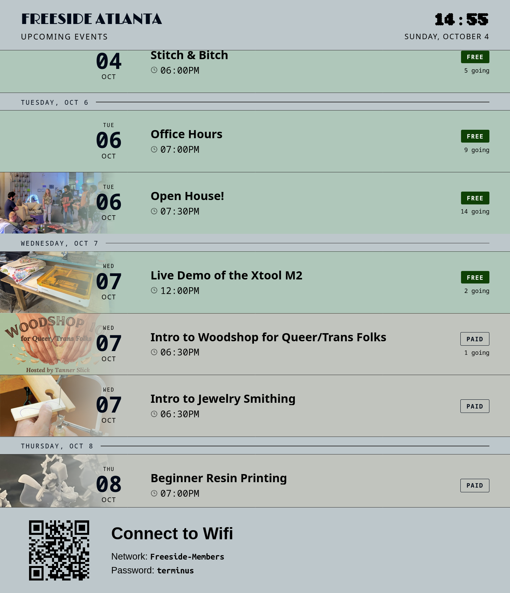

# Freeside Big Sign

Displays Freeside Atlanta events from Meetup and Discord.



## Run locally

With [uv](https://docs.astral.sh/uv/getting-started/installation/) installed:

```sh
uv python install 3.13
uv sync --locked
cp .env.example .env
```

Set `TOKEN` in `.env` to the Freeside Discord bot token. The collector uses the
bot's first server.

```sh
bash start-fetch.sh
bash start-server.sh
```

Open <http://localhost:8080/>

## Deploy

```sh
python3 deploy/deploy.py
```

See [deployment prerequisites](deploy/README.md).

## Before committing Python changes

GitHub Actions runs formatting, lint, type, and unit test checks on every push
and pull request using Python from `.python-version` and dependencies from
`uv.lock`. You can also run CI manually from the Actions tab.

```sh
uv run ruff format .
uv run ruff check .
uv run ty check
uv run python -m unittest discover -s tests
node --test tests/test_sign.cjs
```

